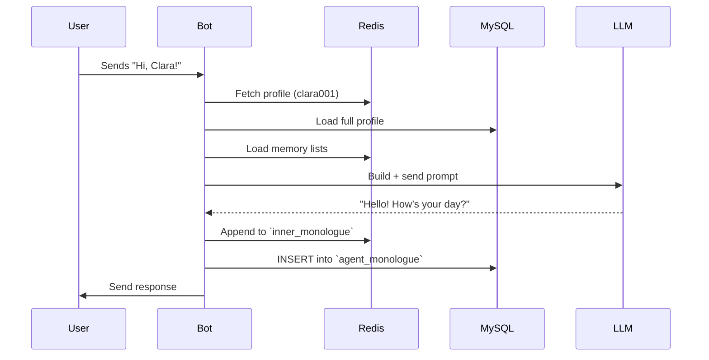
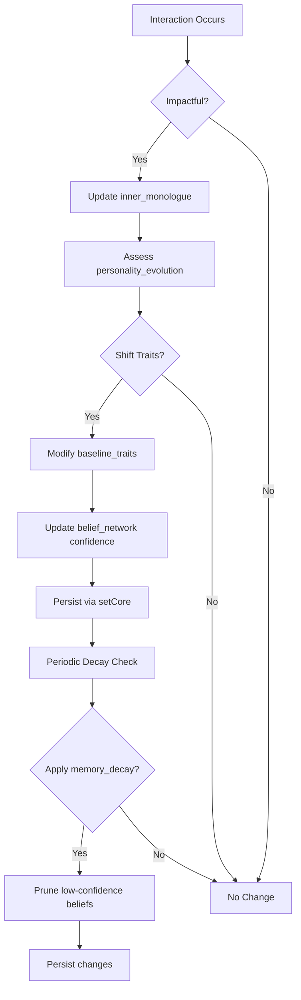
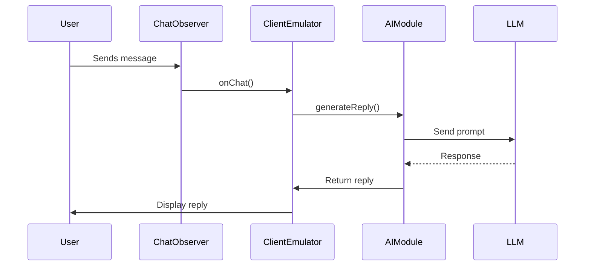
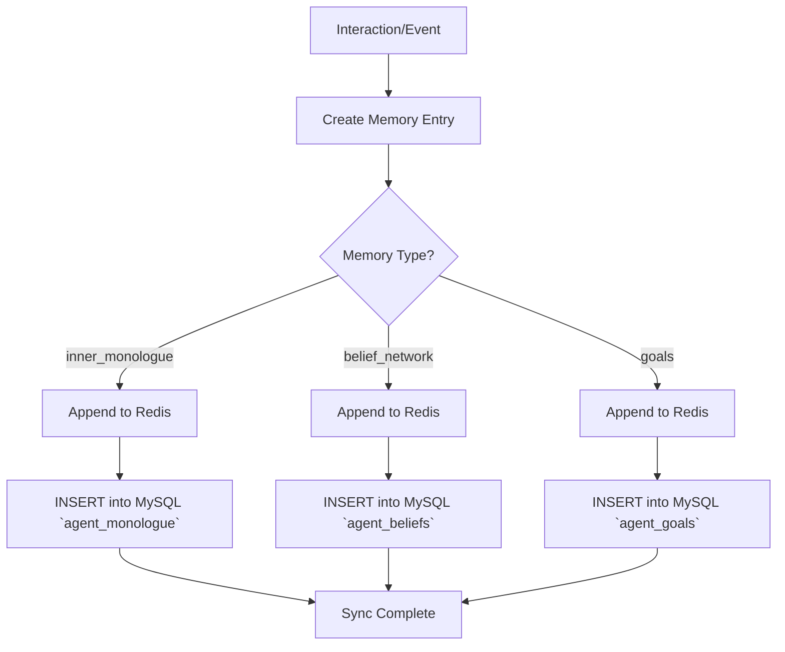
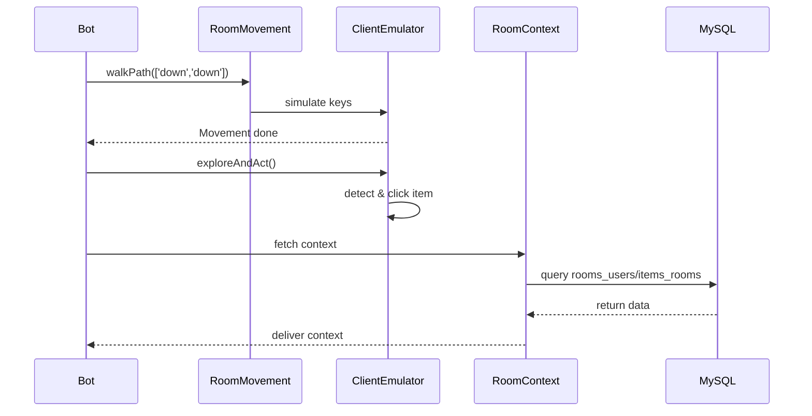

# Satellite-HB-C1 PAi-OS Virtual World Agent Framework

  
*Empowering immersive virtual agents with memory, personality, and dynamic interactions*  

---

## Table of Contents

1. [Overview](#overview)  
2. [Features](#features)  
3. [Installation](#installation)  
4. [Configuration](#configuration)  
5. [Architecture](#architecture)  
   - [Agent Profiles](#agent-profiles)  
   - [Memory System](#memory-system)  
   - [Personality Evolution](#personality-evolution)  
   - [Communication Flow](#communication-flow)  
   - [Room Interaction](#room-interaction)  
6. [Mermaid Flowcharts](#mermaid-flowcharts)  
   - [Chat & Memory Cycle](#chat--memory-cycle)  
   - [Personality Evolution](#personality-evolution-flow)  
   - [Communication Flow](#communication-flow-diagram)  
   - [Memory Storage Workflow](#memory-storage-workflow)  
   - [Room Interaction Workflow](#room-interaction-workflow)  
7. [Usage](#usage)  
8. [Contributing](#contributing)  
9. [License](#license)  

---

## Overview

The **PAi-OS Virtual World Agent Framework** is a robust platform for creating and managing AI-driven agents in a Habbo-style virtual environment. Each agent operates with a unique personality, persistent memory, and dynamic interaction capabilities, powered by Redis (fast cache), MySQL (durable store), and tiered LLMs. Agents like Clara, Dorian, and Jimmy chat, trade items, navigate rooms, and evolve based on experiences.

---

## Features

- **Dynamic Agent Profiles**  
- **Persistent Memory** (Redis + MySQL)  
- **Personality Evolution** (trait shifts & decay)  
- **Contextual Communication** (LLM-powered responses)  
- **Room Interaction** (movement & item handling)  
- **Modular Design** (chat observer, UI mapper, movement)  

---

## Installation

### Prerequisites

- Node.js v18+  
- MySQL 8.0+  
- Redis 6.0+  
- Ollama or compatible LLM API  
- Puppeteer & Chromium  

### Steps

```bash
git clone repository
cd pai-os-agent-framework

npm install
cp .env.example .env     # edit DB, Redis, LLM credentials
cp config/bots-config.example.js config/bots-config.js
npm run init-db
npm run start
````

---

## Configuration

### Environment Variables (`.env`)

```dotenv
DB_HOST=localhost
DB_USER=root
DB_PASS=your_password
DB_NAME=pai_os
REDIS_HOST=127.0.0.1
REDIS_PORT=6379
OLLAMA_URL=http://localhost:11434/api/generate
```

### Bot Config (`config/bots-config.js`)

```js
module.exports = [
  {
    botId: 1,
    username: 'Clara',
    iframeUrl: 'https://game.virtualworld.com/react/index.html?sso=Hotel-266/0ca...',
    roomId: 1
  },
  // Add more bots...
];
```

---

## Architecture

### Agent Profiles

Stored as JSON (in MySQL `agents` + Redis cache). Key fields:

* `core_id`, `chosen_name`
* `emotional_palette`, `belief_network`
* `daily_routine`, `relationships`

### Memory System

* **Redis**: short-term lists (`inner_monologue`, `belief_network`)
* **MySQL**: long-term tables (`agent_monologue`, `agent_beliefs`, `agent_goals`)

### Personality Evolution

* **Baseline Traits** (e.g. empathy, curiosity)
* **Event-Driven Shifts** (via `personality_evolution.shifted_by_events`)
* **Periodic Decay** (prune low-confidence beliefs)

### Communication Flow

1. **Input**: user message via `chatObserver.js`
2. **Processing**: `aiModule.js` builds LLM prompt (profile + memory + context)
3. **Output**: send via `client-emulator.js`

### Room Interaction

* **Movement**: `room-movement.js` simulates arrow keys
* **Item Handling**: `client-emulator.js` clicks items/seats
* **Context**: `room-context.js` queries MySQL for users/items

---

## Mermaid Flowcharts

### Chat & Memory Cycle



### Personality Evolution Flow



### Communication Flow Diagram



### Memory Storage Workflow



### Room Interaction Workflow



---

## Usage

### Add a New Agent

1. Create `profiles/dorian_profile.json`.
2. Add entry in `config/bots-config.js`.
3. Bootstrap:

```bash
node scripts/bootstrap-agent.js
```

### Inspect Memory

* **Redis**: `LRANGE clara001:inner_monologue 0 -1`
* **MySQL**: `SELECT * FROM agent_monologue WHERE core_id='dorian002';`

---

*Built with 🌱 by the PAi-OS Team, 2025.*

