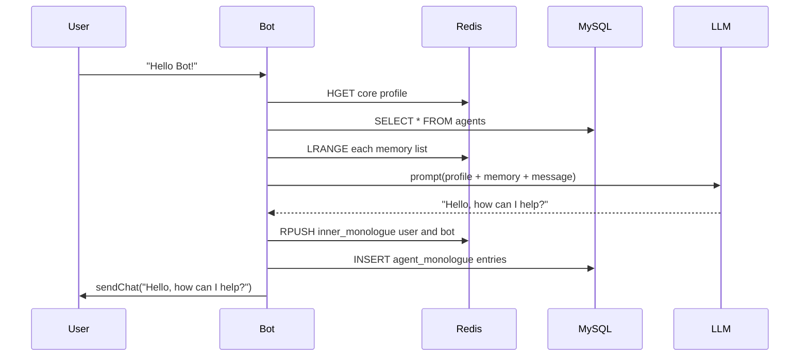
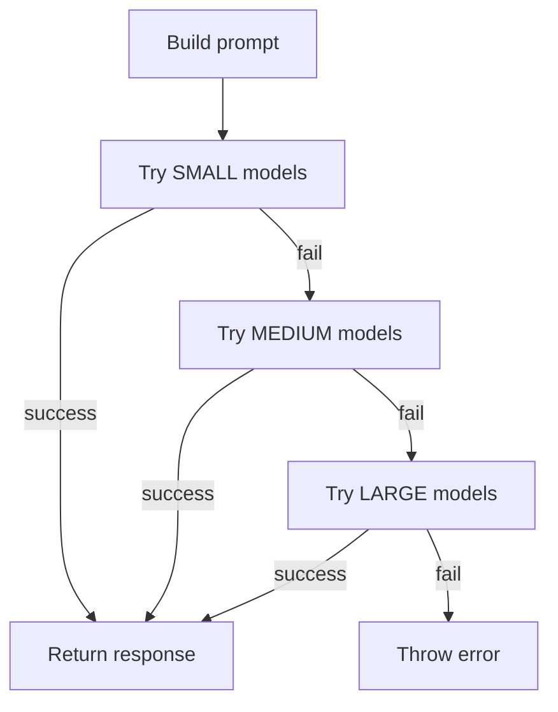

# PAi-OS Satellite v8

A modular AI-chatbot framework with per-agent memory in Redis (fast) and MySQL (persistent), powered by tiered LLMs.

---

## Table of Contents

1. [Overview](#overview)  
2. [Installation](#installation)  
3. [Configuration](#configuration)  
4. [Architecture](#architecture)  
   - [Chat Loop](#chat-loop)  
   - [Memory per Agent](#memory-per-agent)  
   - [Personality System & Evolution](#personality-system--evolution)  
5. [Mermaid Flowcharts](#mermaid-flowcharts)  
6. [Usage](#usage)  
7. [Contributing](#contributing)  
8. [License](#license)  

---

## Overview

Each “bot”:

- Launches a Puppeteer client into a Habbo-style iframe  
- Observes chat messages  
- Loads profile (MySQL) and memory (Redis)  
- Builds prompt, calls LLM (small→medium→large)  
- Appends new monologue to memory  
- Sends reply back  

---

## Installation

```bash
clone this repo

cd pai-os-satellite-hb-c1
npm install
cp .env.example .env
cp config/bots-config.example.js config/bots-config.js
# Edit credentials in .env and bots-config.js
npm run start
````

---

## Configuration

* **.env** — DB\_HOST, DB\_USER, DB\_PASS, DB\_NAME, REDIS\_HOST, REDIS\_PORT, OLLAMA\_URL
* **config/bots-config.js** — one entry per bot: botId, username, password, iframeUrl, roomId
* **db/schema.sql** & **db/init.js** — create/alter tables automatically

---

## Architecture

### Chat Loop

1. `satellite-v8.js` → `initMySQL()`
2. For each bot config: launch HabboClient (Puppeteer)
3. OnChat handler filters, applies cooldowns
4. Load profile (`getCore`) and memory lists (`getList`)
5. Build system+user prompt
6. `aiModule.generateReply()` → LLM tiers
7. Append to Redis + MySQL (`addToList`)
8. `client.sendChat(reply)`

### Memory per Agent

* **Redis lists** for fast reads/writes
* **MySQL tables** for durability
* Lists: `belief_network`, `inner_monologue`, `goals`, `daily_routine`, `relationships`, etc.

### Personality System & Evolution

* **Profile fields** stored in MySQL `agents` table (JSON columns for traits)
* **Core profile**: chosen\_name, philosophical\_position, current\_emotion, cognitive\_traits
* **Memory lists** inform ongoing “internal reasoning” without exposing it
* **Evolution**:

  * On each interaction, inner\_monologue and belief\_network grow
  * Periodic “decay” or “revision” can be applied by pruning low-confidence beliefs or timestamps older than X
  * New profile state can be written via `setCore`, updating JSON fields to reflect learned traits or changed emotional\_palette

---

## Mermaid Flowcharts

### 1. Chat + Memory Cycle



### 2. Multi-Tier LLM Fallback



---

## Usage

* **Add bot**: edit `config/bots-config.js`, restart
* **Bootstrap profile**:

  ```bash
  node scripts/bootstrap-agent.js
  ```
* **Inspect memory**:

  * Redis CLI: `LRANGE <coreId>:inner_monologue 0 -1`
  * MySQL: `SELECT * FROM agent_monologue WHERE core_id='<coreId>';`

---


